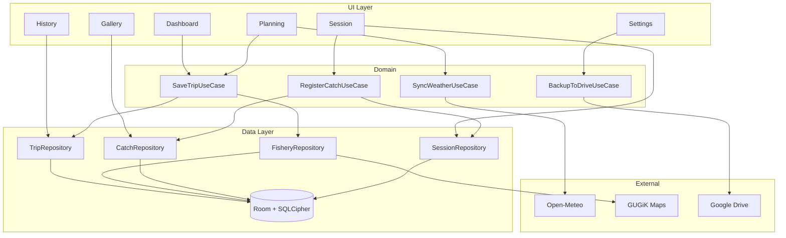

# Architektura – Śledzik brań (SIEDZI!)

> Diagram modułów i warstw aplikacji. Odniesienie przy implementacji Etapu I–V.

---

## Warstwy aplikacji

```
┌─────────────────────────────────────────────────────────────────┐
│                     UI (Jetpack Compose)                        │
│  Screens · ViewModels · Navigation · Design System              │
└─────────────────────────────────────────────────────────────────┘
                              │
┌─────────────────────────────────────────────────────────────────┐
│                     Domain (Use Cases)                           │
│  SaveTrip · RegisterCatch · BackupToDrive · SyncSession          │
└─────────────────────────────────────────────────────────────────┘
                              │
┌─────────────────────────────────────────────────────────────────┐
│                     Data Layer                                  │
│  Repositories · DAOs · Room (SQLCipher) · Local Cache            │
└─────────────────────────────────────────────────────────────────┘
                              │
┌─────────────────────────────────────────────────────────────────┐
│                     External                                    │
│  Open-Meteo · GUGiK WMTS · Google Drive API · File System        │
└─────────────────────────────────────────────────────────────────┘
```

---

## Diagram modułów (Mermaid)



---

## Moduły funkcjonalne

| Moduł | Odpowiedzialność | Główne ekrany |
|-------|------------------|---------------|
| **Core** | Splash, Onboarding, Nawigacja, Ustawienia bazowe | 01, 02, 24–26, 21 |
| **Planning** | Planowanie wyprawy, wybór daty, łowisko, analiza | 04–07 |
| **Departure** | Dzień wyjazdu, odświeżanie danych, pobieranie map | 08 |
| **Session** | Aktywna sesja, meldunek, hub, formularz zasadzki | 09–11 |
| **Timeline** | Oś czasu, zmiana zestawu, rejestracja połowu | 12–15 |
| **Closure** | Zakończenie sesji, karta sesji, bottom sheet | 16 |
| **History** | Lista sesji, szczegóły, filtrowanie | 17–18 |
| **Gallery** | Galeria zdjęć, karuzela, udostępnianie | 19–20 |
| **Settings** | Eksport, słowniki, łowiska, motyw | 21–23 |

---

## Przepływ danych – kluczowe ścieżki

### Planowanie → Sesja

```
Trip (plan) → Session (active) → TimelineEntry (cast) → Catch → TimelineEntry (catch)
```

### Rejestracja połowu (3 sekundy)

```
Aparat → Zdjęcie → CatchCard (gatunek + waga) → AutoMetadata → Zapisz → Oś czasu
```

### Active Session Banner

```
Session.isActive == true → Banner widoczny na: Dashboard, Galeria, Historia, Ustawienia
Session.isActive == false → Banner ukryty
```

---

## Zależności techniczne (planowane)

| Biblioteka | Wersja | Zastosowanie |
|------------|--------|--------------|
| Kotlin | 1.9+ | Język |
| Jetpack Compose | BOM | UI |
| Room | 2.6+ | Baza danych |
| SQLCipher | 4.x | Szyfrowanie DB |
| Coil | 2.x | Obrazy (galeria) |
| Retrofit / OkHttp | 4.x | Open-Meteo, GUGiK |
| Google Auth / Drive | latest | Backup |
| Accompanist (opcjonalnie) | — | Permissions, FlowLayout |

---

## Offline-First – zasady

1. **Room** – źródło prawdy. Wszystkie dane sesji, połowów, łowisk lokalnie.
2. **Cache** – pogoda, solunar, tile’y map buforowane przed wyjazdem.
3. **Sync** – Google Drive tylko gdy jest sieć; dane buforowane lokalnie.
4. **Rejestracja** – działa bez sieci; metadane (GPS, czas) lokalne.
